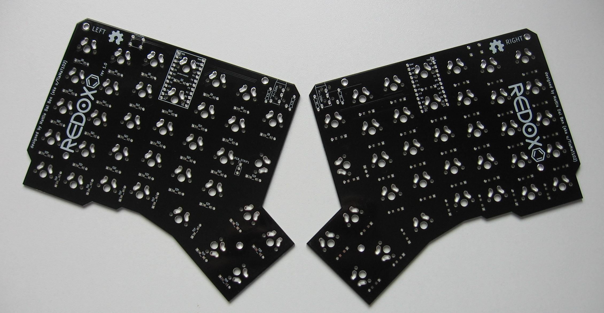
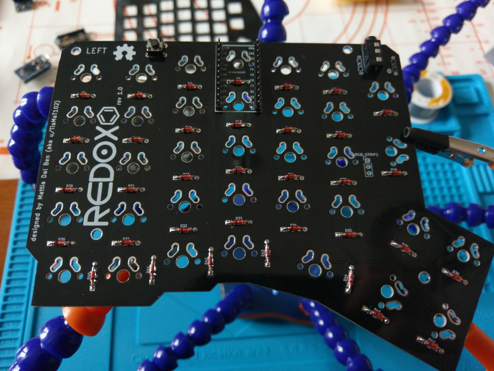
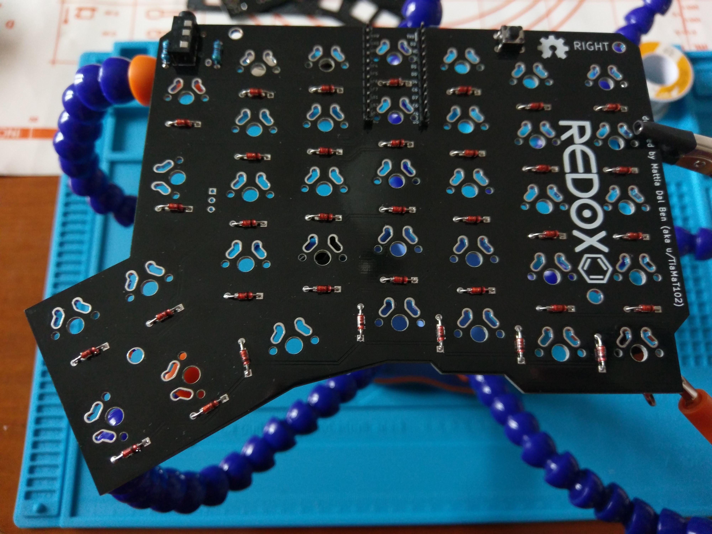
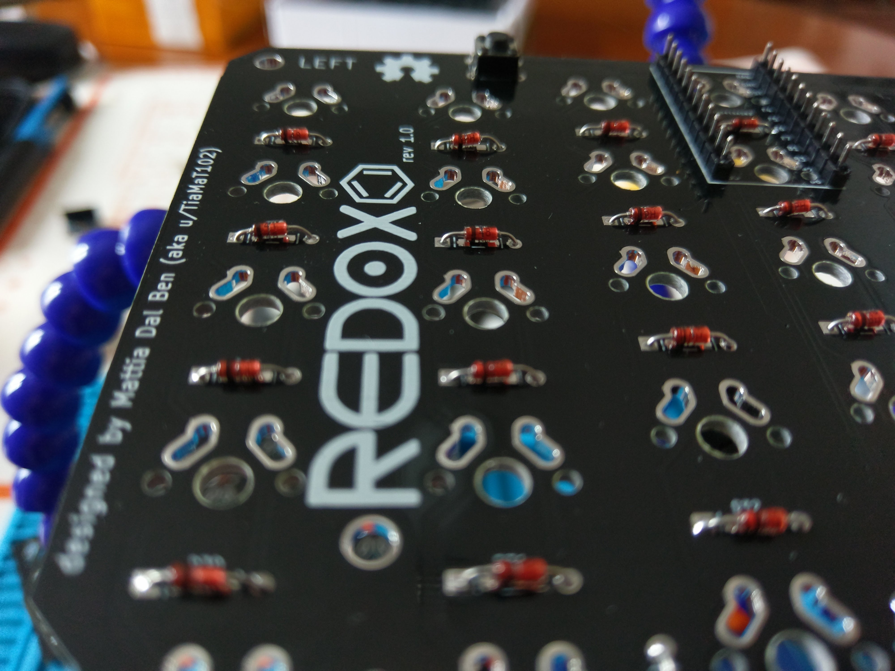
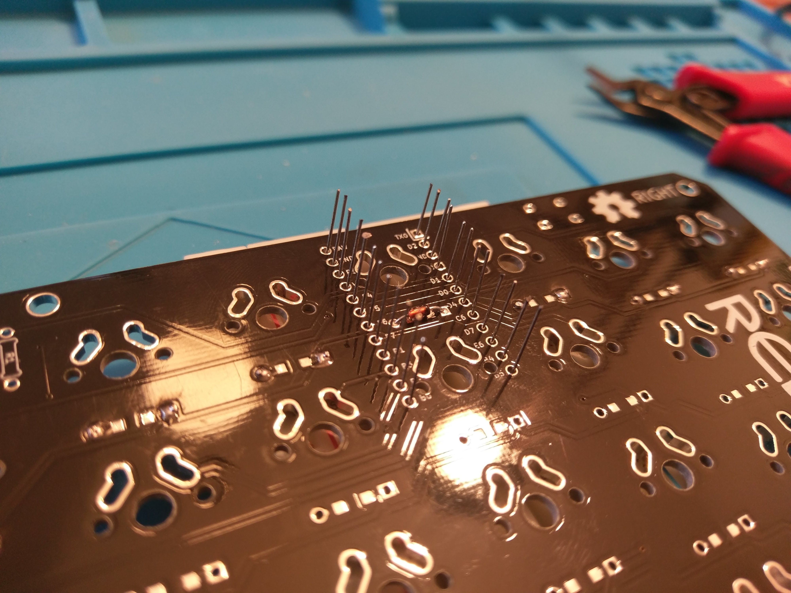
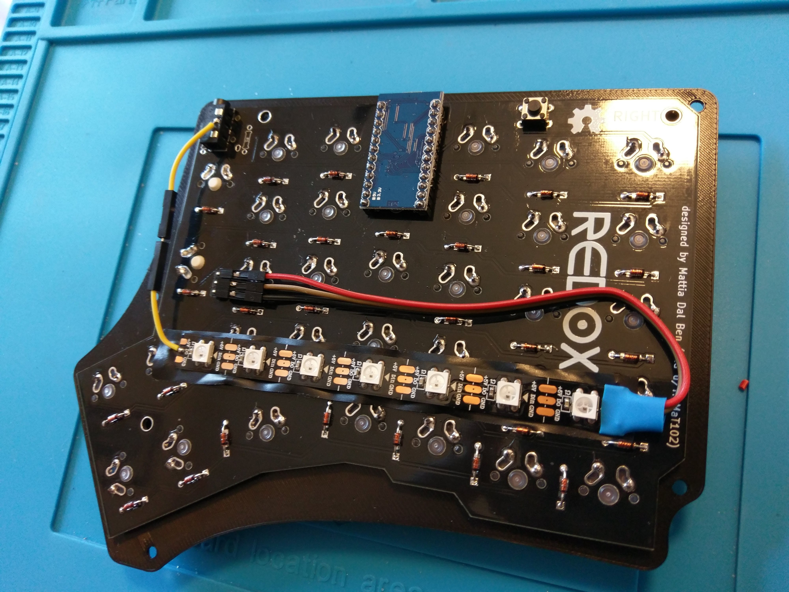
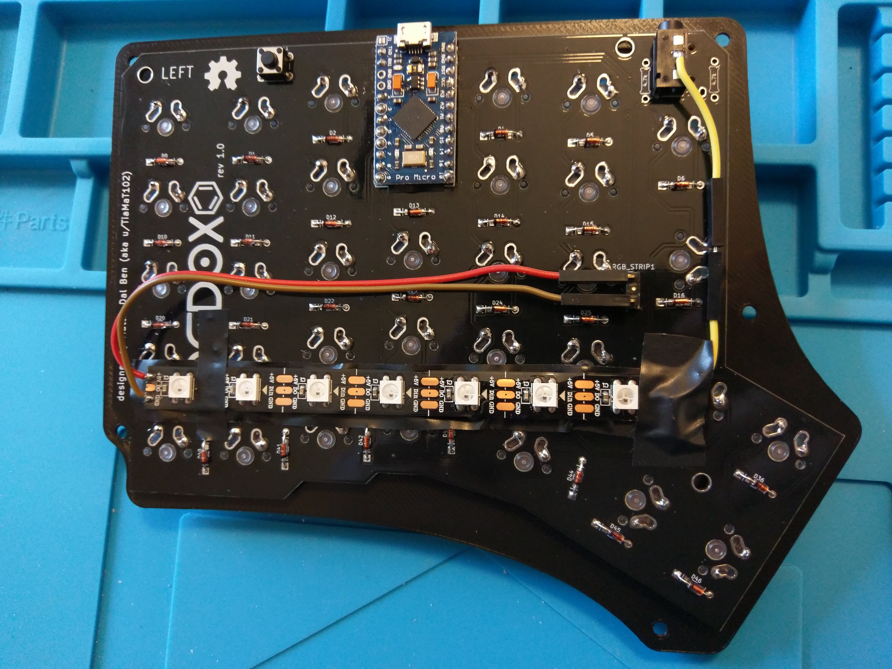

# The Redox project repository

<p align="center">

</p>

The Redox project is an open-source, [QMK (Quantum Mechanical Keyboard Firmware)](https://github.com/qmk/qmk_firmware) powered, ergonomic split mechanical keyboard. This repository will be used to share information about the project and instruction on how to use and assembly the Redox keyboard.

**Designer's bio**: [Mattia Dal Ben (aka u/TiaMaT102)](mailto:matthewdibi@gmail.com) obtained a master's degree in Engineering Electronics with a specialization in Computer Science at the University of Udine. Currently works as a Software Engineer in R&D department for a big IoT and Embedded Computers company. Mechanical keyboard enthusiast and maker, the Redox keyboard is the result of all of his passions.


## Related projects

- Redox handwire
  - [Redox handwire](https://www.thingiverse.com/thing:2704567): handwired 3D printed Redox prototype. Freely available.
  - [Tilted Redox case](https://www.thingiverse.com/thing:2767216): tilted case for the Redox prototype by jschloer.
  - [couscous-kbd](https://github.com/CoenSchalkwijk/couscous-kbd): Redox-inspired parametric OpenSCAD keyboard design.
  - [Redox tenting kit](https://www.thingiverse.com/make:484843): modified base to support tenting, mini-USB for the interconnect, and a hole for microswitch for reset needed when uploading new firmware by [Lenbok](https://github.com/Lenbok).

## Redox rev.1

The Redox rev.1 is the first commercially available version of the Redox keyboard.

Hardware availability:
  - [Falbatech](https://falba.tech/)

### Building instructions

  - [Bill of materials](#bill-of-materials)
  - [Assembly](#assembly)
  - [Firmware](#firmware)
  - [RGB Underglow](#rgb-underglow)

#### Bill-of-Materials

| Qty | Item                                          | Notes                                               |
|----:|-----------------------------------------------|-----------------------------------------------------|
|  70 | Cherry MX compatible switches                 |                                                     |
|   2 | Redox PCBs                                    |                                                     |
|  70 | 1N4148 diodes                                 | SMD diodes can also be used                         |
|   2 | PJ-320A 4 poles 3.5 mm TRRS connectors        |                                                     |
|   2 | 4.7 kOhm resistors                            | Need to be soldered on one half only                |
|   2 | Through hole momentary switch                 | Dimensions 6mm x 6mm x 4.3mm                        |
|   2 | Arduino Pro Micro compatible microcontrollers |                                                     |
|   1 | TRRS cable                                    |                                                     |
|   1 | USB micro cable                               |                                                     |
|  70 | Cherry MX compatible keycaps                  | 10x 1.25u keycaps, 6x 1.5u keycaps, 54x 1u keycaps, |
|  14 | WS2812/WS2812B leds                           | Optional RGB-underglow                              |

#### Assembly

<p align="center">

</p>

Installation steps:

- Solder components:
  1. Solder 1N4148 diodes. Keep the diode legs for the right hand controller installation.
  2. Solder PJ-320A connectors.
  3. Solder momentary switches.
  4. Solder 4.7k Ohm resistors **on one half only**. If you are going for the RGB-underglow ignore this step.
  5. Solder the Pro Micro header pins (**do not solder the Pro Micro controllers yet**). For the right hand use the diodes legs as this will make the controller's USB port much lower, this is needed for the 3D printed case. See [right hand controller installation detail](#right-hand-controller-installation-detail)
  6. Optional see [RGB-underglow instructions](#rgb-underglow).
- Flip the PCBs.
- Solder switches to the PCB.
- Flip the PCBs again.
- Solder Pro Micros to the header pins following the PCB labelling.

##### Right hand back side:
<p align="center">

</p>

##### Left hand back side:
<p align="center">

</p>

##### Diode installation detail:
<p align="center">

</p>

##### Right-hand-controller-installation-detail:

1. Use a breadboard to keep the diode's legs from falling.
2. Solder the diode's legs in place.
3. Cut the excess.
4. Apply some electrical tape under the controller to prevent shorts.
5. Install your preferred switches (**remember: the controller installation is the last step**).
6. Solder the controllers in place.

<p align="center">


</p>

#### Firmware

The Redox uses QMK for its firmware, follow the QMK installation instructions [here](https://docs.qmk.fm/install-build-tools), then compile and burn the firmware as follows:

```sh
$ cd path/to/qmk_firmware
$ make redox/rev1:default:avrdude
```

You can find the code for the Redox here: [QMK - Redox keyboard](https://github.com/qmk/qmk_firmware/tree/master/keyboards/redox).

#### RGB-Underglow

Parts:
- [ ] WS2812/WS2812B LED strip
- [ ] 24 AWG (or smaller) stranded wire (white, red, black are good choices)

Data connection:

```
Led strip Headers -> DIN -> DO -> TRRS pad -> (TRRS to other side) -> TRRS pad -> DIN
```

Installation steps:

##### LEFT hand as master (usually plugged in to the PC)
- On the LEFT hand:
  1. Solder the LED Strip headers as seen in the pictures below.
  2. Solder the DO Pin of the RGB strip to the TRRS pad as seen in the figures below.
- On the RIGHT hand:
  1. Solder VCC and GND of the RGB strip to the LED Strip headers.
  2. Solder the DIN Pin of the RGB strip to the TRRS pad as seen in the figures below.
- Flash the firmware with the serial and RGB Backlight options on, specifying the number of LEDs installed (see instruction here).

##### Left hand back side:
<p align="center">

</p>

##### Right hand back side:

<p align="center">

</p>

##### RIGHT hand as master.
- On the RIGHT hand:
  1. Solder the LED Strip headers to the RGB strip.
  2. Solder the DO Pin of the RGB strip to the TRRS pad.
- On the LEFT hand:
  1. Solder VCC and GND of the RGB strip to the LED Strip headers.
  2. Solder the DIN Pin of the RGB strip to the TRRS pad.

**Notes**:
- You don't need to solder the 4.7k resistors since the I2C connection won't be used.
- You can use only one hand as master.

##### RGB Underglow firmware

To enable RGB backlighting you need to modify the default firmware as follows:
- Use serial communication instead of I2C.
- Set the master hand.
- Set the number of LED you installed.

To do this, modify `qmk_firmware/keyboards/redox/keymaps/default/config.h` as follows:

```c++
// ...

/* You need to use the sarial communication since we 
used a cable to carry the data signal for the LED strip */
#define USE_SERIAL

/* Select hand configuration: you need to use as master 
the hand that drives the LED strip */
#define MASTER_LEFT
// #define MASTER_RIGHT

/* Put the total number of led used here */
#undef RGBLED_NUM
#define RGBLIGHT_ANIMATIONS
#define RGBLED_NUM 14
#define RGBLIGHT_HUE_STEP 8
#define RGBLIGHT_SAT_STEP 8
#define RGBLIGHT_VAL_STEP 8

// ...
```

Then compile and burn the firmware on both controllers:

```sh
$ cd path/to/qmk_firmware
$ make redox/rev1:default:avrdude
```

#### Layout

<p align="center">

</p>

[KLE Layout permalink](http://www.keyboard-layout-editor.com/##@_name=Redox&author=Mattia%20Dal%20Ben&switchMount=cherry&plate:false&pcb:false%3B&@_x:3.5%3B&=%23%0A3&_x:10.5%3B&=*%0A8%3B&@_y:-0.875&x:2.5%3B&=%2F@%0A2&_x:1%3B&=$%0A4&_x:8.5%3B&=%2F&%0A7&_x:1%3B&=(%0A9%3B&@_y:-0.875&x:5.5%3B&=%25%0A5&_x:6.5%3B&=%5E%0A6%3B&@_y:-0.875&x:0.25&a:7&w:1.25%3B&=&_a:4%3B&=!%0A1&_x:14.5%3B&=)%0A0&_a:7&w:1.25%3B&=%3B&@_y:-0.625&x:6.5%3B&=&_x:4.5%3B&=%3B&@_y:-0.75&x:3.5&a:4%3B&=E&_x:10.5%3B&=I%3B&@_y:-0.875&x:2.5%3B&=W&_x:1%3B&=R&_x:8.5%3B&=U&_x:1%3B&=O%3B&@_y:-0.875&x:5.5%3B&=T&_x:6.5%3B&=Y%3B&@_y:-0.875&x:0.25&a:7&w:1.25%3B&=&_a:4%3B&=Q&_x:14.5%3B&=P&_a:7&w:1.25%3B&=%3B&@_y:-0.625&x:6.5&h:1.5%3B&=&_x:4.5&h:1.5%3B&=%3B&@_y:-0.75&x:3.5&a:4%3B&=D&_x:10.5%3B&=K%3B&@_y:-0.875&x:2.5%3B&=S&_x:1&n:true%3B&=F&_x:8.5&n:true%3B&=J&_x:1%3B&=L%3B&@_y:-0.875&x:5.5%3B&=G&_x:6.5%3B&=H%3B&@_y:-0.875&x:0.25&a:7&w:1.25%3B&=&_a:4%3B&=A&_x:14.5%3B&=%2F:%0A%2F%3B&_a:7&w:1.25%3B&=%3B&@_y:-0.375&x:3.5&a:4%3B&=C&_x:10.5%3B&=%3C%0A,%3B&@_y:-0.875&x:2.5%3B&=X&_x:1%3B&=V&_x:8.5%3B&=M&_x:1%3B&=%3E%0A.%3B&@_y:-0.875&x:5.5%3B&=B&_x:6.5%3B&=N%3B&@_y:-0.875&x:0.25&a:7&w:1.25%3B&=&_a:4%3B&=Z&_x:14.5%3B&=%3F%0A%2F%2F&_a:7&w:1.25%3B&=%3B&@_y:-0.375&x:3.5%3B&=&_x:10.5%3B&=%3B&@_y:-0.875&x:2.5%3B&=&_x:12.5%3B&=%3B&@_y:-0.75&x:0.5%3B&=&=&_x:14.5%3B&=&=%3B&@_r:15&y:-2.625&x:5.75&w:1.25%3B&=%3B&@_r:30&rx:6.5&ry:4.25&y:-1%3B&=&=%3B&@_h:1.5%3B&=&_h:1.5%3B&=%3B&@_r:-30&rx:13&y:-1&x:-2%3B&=&=%3B&@_x:-2&h:1.5%3B&=&_h:1.5%3B&=%3B&@_r:-15&rx:0&ry:0&y:7.75&x:11.75&w:1.25%3B&=)
