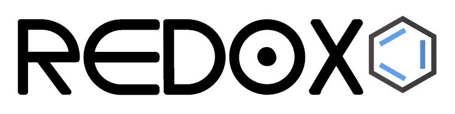
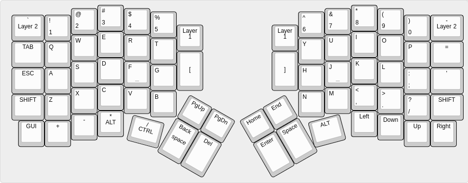

<h3 align="center">The Redox project repository</h3>

---

The Redox project is an open-source, [QMK (Quantum Mechanical Keyboard Firmware)](https://github.com/qmk/qmk_firmware) powered, ergonomic split mechanical keyboard. This repository will be used to share information about the project and instruction on how to use and assemble the Redox keyboard.

**Designer's bio**: [Mattia Dal Ben (aka u/TiaMaT102)](mailto:matthewdibi@gmail.com) obtained a master's degree in Electrical Engineering with a specialization in Computer Science at the University of Udine. Currently works as a Software Engineer in R&D department for a big IoT and Embedded Computers company. Mechanical keyboard enthusiast and maker, the Redox keyboard is the result of all of his passions.

## Rationale

The Redox is a keyboard project designed with ergonomics in mind. It uses Cherry MX style mechanical switches laid out in a 7x5 columnar stagger layout with components that can easily be sourced.

The design was heavily inspired by the [Ergodox keyboard](https://www.ergodox.io/), and its main goal is to reduce the size without sacrificing too many keys, hence the name **Re**duced Ergo**dox**.

As an Ergodox user I couldn't ignore the few flaws of the original design and in a moment of arrogance I tried to fix them, thus the Redox features:
- Easier to reach thumb cluster.
- Additional easy-to-reach rotated 1.25u thumb key.
- Reduced size.
- Reduced costs (the Redox uses Arduino Pro Micro instead of the Teensy 2.0).
- Either half can be plugged in to the PC since each half can act as the master.
- Either half can work as a standalone keyboard to be used as a macropad/gaming keyboard.
- RGB backlighting support.
- 3D-printer friendly case.
- Wireless [see section below](#wireless-implementations)
- [VIA](https://caniusevia.com/) compatible (thanks to [Harshit Goel](https://github.com/harshitgoel96))
- [ZMK firmware](https://zmk.dev/) compatible (thanks to [toddmok](https://github.com/toddmok))

## Related projects

- [**Redox handwire**](https://www.thingiverse.com/thing:2704567): The first incarnation of the Redox keyboard. It consists of a 3D-printed case and a handwired matrix.
  - [Tilted Redox case](https://www.thingiverse.com/thing:2767216): tilted case for the Redox prototype by jschloer.
    - [Tilted redox case pro micro](https://www.printables.com/model/382413-tilted-redox-case-for-micro-and-usbc): Remix of the tilted case to support pro micro and usb c instead of TRRS. 

  - [couscous-kbd](https://gitlab.com/cschalkwijk/couscous-kbd): Redox-inspired parametric OpenSCAD keyboard design.
  - [Redox tenting kit](https://www.thingiverse.com/make:484843): modified base to support tenting, mini-USB for the interconnect, and a hole for microswitch for reset needed when uploading new firmware by [Lenbok](https://github.com/Lenbok).
  - [Iris-inspired Redox case](https://github.com/Lenbok/scad-redox-case): a case inspired both by the Redox rev1.0 and the Iris designed with OpenSCAD by [Lenbok](https://github.com/Lenbok).
  - [Redodactyl keyboard](https://www.reddit.com/r/MechanicalKeyboards/comments/9j5pw5/enter_the_redodactyl_first_build/): handwired 3D printed Dactyl-inspired Redox variant by u/darknao.
- [**Redox Manuform**](https://www.thingiverse.com/thing:3503380): full rework of the Redox case inspired by the Dactyl Manuform. Designed by [Fosk\_LL](https://www.thingiverse.com/Fosk_LL/about).
- [**Redox rev1.0**](https://github.com/mattdibi/redox-keyboard/tree/master/redox): the Redox rev 1.0 is the first commercially available version of the Redox keyboard.
	- Rev1.0 PCBs: available at [Falbatech's store](https://falba.tech/product/redox-pcb-electrical-boards-set-of-2/)
    - Firmware sources:
        - [QMK firmware for Redox](https://github.com/mattdibi/qmk_firmware/tree/master/keyboards/redox)
	- 3D-printable cases:
        - [3D printable case](https://www.thingiverse.com/thing:2886662), freely available.
        - [Redox keyboard case (high profile)](https://www.thingiverse.com/thing:3825752), by [Michele Ferri](https://www.thingiverse.com/sako83/about).
        - [Travel-friendly Redox Keyboard case](https://www.thingiverse.com/thing:3607303), by [Fosk\_LL](https://www.thingiverse.com/Fosk_LL/about).
        - [Redox Neodox case](https://github.com/Pastitas/Redox-neodox-Case), by [Pastitas](https://github.com/Pastitas)
        - [Redox big battery](https://github.com/marco-silvestri/redox-big-battery), by [Marco Silvestri](https://github.com/marco-silvestri).
	- Commercially available cases:
		- [Falbatech's bamboo cases with tilt kit](https://falba.tech/product/redox-standard-lift-bamboo-wood-case-with-oil-finish/)
		- [Falbatech's fullhand bamboo cases](https://falba.tech/product/redox-fullhand-bamboo-wood-case-with-oil-finish-ver-2/)
- [**Redox rev1.0W**](https://github.com/mattdibi/redox-keyboard/tree/master/redox-w): the Redox rev 1.0W is the wireless version of the Redox keyboard.
    - Rev1.0W PCBs: gerbers available in [this repo](https://github.com/mattdibi/redox-keyboard/tree/master/redox-w/rev1.0W).
    - Falbatech's Rev1.0W Hot-swap PCBs: available at [Falbatech's store](https://falba.tech/product/redox-wireless-pcb-electrical-boards-set-of-2/) (Incompatible with the 3D-printable cases down below)
    - Firmware sources:
        - [QMK firmware for Redox wireless](https://github.com/mattdibi/qmk_firmware/tree/master/keyboards/redox_w)
        - [Nordic MCUs firmware for Redox wireless](https://github.com/mattdibi/redox-w-firmware)
	- 3D-printable cases:
        - [3D printed case](https://github.com/mattdibi/redox-keyboard/tree/master/redox-w/case), freely available.
        - [Redox Neodox case](https://github.com/Pastitas/Redox-neodox-Case), by [Pastitas](https://github.com/Pastitas)
    - Commercially available cases (only compatible with the Falbatech's store PCBs):
        - [Falbatech's bamboo and aliminium cases](https://falba.tech/product/redox-wireless-standard-lift-bamboo-wood-case-with-oil-finish/)
		- [Falbatech's fullhand bamboo cases](https://falba.tech/product/redox-wireless-standard-lift-bamboo-wood-case-with-oil-finish-ver-1/)
- [**Redox rev2.0WHS**](https://github.com/mattdibi/redox-keyboard/tree/master/redox-w): the Redox rev 2.0WHS is the wireless hot-swappable version of the Redox keyboard.
    - Rev2.0WHS PCBs: gerber files available [here](https://github.com/mattdibi/redox-keyboard/tree/master/redox-w/rev2.0WHS/pcb)
    - Firmware sources:
        - [QMK firmware for Redox wireless](https://github.com/mattdibi/qmk_firmware/tree/master/keyboards/redox_w)
        - [Nordic MCUs firmware for Redox wireless](https://github.com/mattdibi/redox-w-firmware)
	- 3D-printable case:
        - [3D printed case](https://github.com/mattdibi/redox-keyboard/tree/master/redox-w/rev2.0WHS/case), freely available.

## Wireless implementations

The Redox keyboard uses two different wireless implementations, for simplicity I'll differentiate them on a firmware basis:
 - *QMK based*: Leveraging the [Gazel protocol](https://developer.nordicsemi.com/nRF5_SDK/nRF51_SDK_v5.x.x/doc/5.2.0/html/a00140.html). It needs its own PCB and a receiver dongle (see [Redox Wireless](https://github.com/mattdibi/redox-keyboard/tree/docs/zmk_update/redox-w) for details) and needs three YJ-14015 MCUs + a Pro Micro compatible controller.
 - *ZMK based*: Leveraging the Bluetooth protocol. It is based on the [Redox wired PCB](https://github.com/mattdibi/redox-keyboard/tree/master/redox) and the [nice!nano](https://nicekeyboards.com/nice-nano/) controller.

 The main differences for the two implementations are as follows:
 - _Battery life_: QMK Redox Wireless uses two CR2032 coin cell batteries which last [approximately one year (YMMV)](https://github.com/mattdibi/redox-keyboard/tree/master/redox-w#battery-usage), while the nice!nano support LiPo rechargable batteries (you can choose the capacity you want but expect them to last for a [few weeks on a single charge](https://zmk.dev/power-profiler)).
 - _Flexibility_: The receiver dongle limits the flexibility of QMK Redox Wireless.
 - _Cost_: The 3x YJ-14015 + Pro Micro combo is cheaper than the two nice!nano you need for the ZMK Redox.
 - _Range_: The Bluetooth implementation should be more capable than what can be achieved with the QMK Redox Wireless (At this point in time, I lack the evidence to support these claims though).

## Layout

### Keycaps

| Size  | Qty |                                     Notes                                    |
|-------|:---:|:----------------------------------------------------------------------------:|
| 1.5u  |   6 |                                                                              |
| 1.25u |  10 | You can get away with 8 if you use two 1u keycaps for the 1.25u rotated keys |
| 1u    |  54 |                                                                              |

> :information_source: On [pimpmykeyboard.com](https://pimpmykeyboard.com/sa-1976-keyset-two-shot/) site you can find a SA 1976 keyset kit specifically made for the Redox keyboard: the "Ergo Redox kit (12 keys)".

## Affiliations

In partnership with Falbatech you can now use the code "**mattdibi05**" on Falbatech's store for a 5% OFF special discount.

## Donations

If you've read this far and found something useful, please consider donating to help me maintain and further develop this project.

