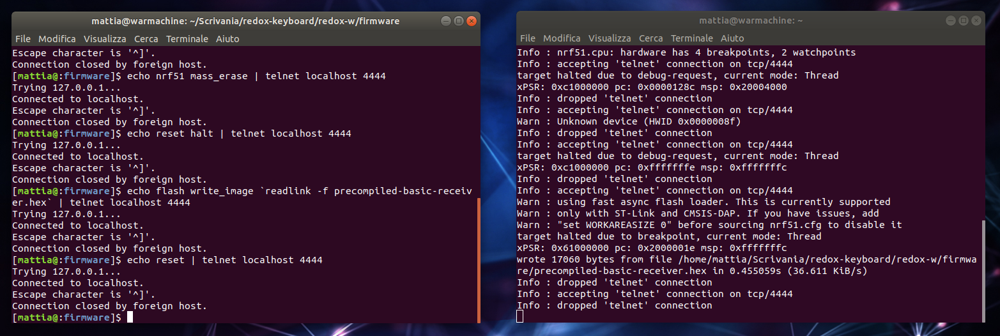

## Redox-W (Wireless)

The Redox-W is the wireless version of the Redox keyboard, it comes in two flavours:

- **Rev 1.0W**: The first revision of the Redox Wireless.
- **Rev 2.0WHS**: Hot-swappable version of the Redox Wireless. It comes with some range improvements and limited compatibility with Rev1.0W cases (more on that in the dedicated section).

The two hardware revision share the firmware and the receiver dongle. In this page you'll find firmware instructions (which are the same for the two PCB versions) for the hardware assembly instructions follow the link below.

- [Rev 1.0W assembly](https://github.com/mattdibi/redox-keyboard/tree/master/redox-w/rev1.0W#transmitters-assembly)
- [Rev 2.0WHS assembly](https://github.com/mattdibi/redox-keyboard/tree/master/redox-w/rev2.0WHS#transmitters-assembly)

## Summary

  - [Firmware](#firmware)
  - [Battery usage](#battery-usage)
  - [Case compatibility](#case-compatibility)

## Firmware

**Basics**: The Redox keyboard works similarly to the [Mitosis keyboard](https://github.com/qmk/qmk_firmware/tree/master/keyboards/mitosis): we have two transmitters responsible for scanning the two matrices, which then transmit the matrix status through the [Gazel protocol](https://developer.nordicsemi.com/nRF5_SDK/nRF51_SDK_v5.x.x/doc/5.2.0/html/a00140.html) to the receiver. The receiver is another YJ-14015 which receives the two matrix scans and send it through serial to the Arduino Pro Micro. The Pro Micro is responsible for running QMK and converting the bytes received by the YJ-14015 into actual keystrokes.

Firmware sources available here: [https://github.com/mattdibi/redox-w-firmware](https://github.com/mattdibi/redox-w-firmware).

You'll need to upload the firmware to the corresponding MCUs as per the following diagram:

<p align="center">

</p>

Note that you'll need to upload the firmware for the YJ-14015 only once. Everything related to the keymap is handled by the Arduino Pro Micro and QMK Firmware, that's what you will need to modify to update the keymap.

### Step-by-step firmware upload guide

#### Arduino Pro Micro Firmware upload

Let's start by uploading the QMK firmware on the Arduino, this will help us in diagnosing problems early on. The Redox uses QMK for its firmware, follow the QMK installation instructions [here](https://docs.qmk.fm/#/getting_started_build_tools), then compile and burn the firmware as follows:

```sh
$ cd path/to/qmk_firmware
$ make redox_w:default:avrdude
```

You can find the code for the Redox here: [QMK - Redox Wireless keyboard](https://github.com/mattdibi/qmk_firmware/tree/redox_wireless/keyboards/redox_w).

In the [Redox Wireless Keyboard firmware repository](https://github.com/mattdibi/redox-w-firmware/tree/master/precompiled) I added some pre-built hex files with the default keymap for testing purpose.

#### Nordic MCUs Firmware upload

You'll need only to flash the pre-built `.hex` files to the corresponding MCUs, for this you'll need an STLinkV2 debugger.

<p align="center">

</p>

*Note*: Tested on Ubuntu 16.04 and 18.04 but you should be able to find alternatives on all distros.

##### Setup

###### Install OpenOCD (Open On-Chip Debugger)

```sh
sudo apt update
sudo apt install openocd
```

###### Download the repository

Open a terminal and download this repository wherever you want. We'll need the `redox-w/firmware` folder content.

```sh
git clone https://github.com/mattdibi/redox-keyboard.git
```

or

```sh
wget https://github.com/mattdibi/redox-keyboard/archive/master.zip
```

###### Install the udev rules

```sh
cd path/to/repository/redox-keyboard/redox-w/firmware/
sudo cp 49-stlinkv2.rules /etc/udev/rules.d/
```

##### Programming the receiver

###### Hook up the receiver

Hook up the ST-Link debugger to the receiver board you assembled without the Arduino. You need to connect only the `VCC`, `GND`, `SWDIO` and `SWCLK` pins of the receiver board like this:

| ST-Link Debugger | Receiver board |
|------------------|----------------|
|       3.3V       |       VCC      |
|        GND       |       GND      |
|       SWCLK      |      SWCLK     |
|       SWDIO      |      SWDIO     |

<p align="center">

</p>

Then plug in the ST-Link debugger into your PC.

###### Launch a OpenOCD server session

In a new terminal window launch an OpenOCD server session by issuing the following command:

```sh
openocd -s /usr/local/Cellar/open-ocd/0.8.0/share/openocd/scripts/ -f interface/stlink-v2.cfg -f target/nrf51.cfg
```

This should give the following output:

```sh
Info : nrf51.cpu: hardware has 4 breakpoints, 2 watchpoints
```

Leave this terminal window open.

###### Receiver firmware flashing

We can now issue the flashing commands. Open a terminal in the redox-w firmware folder.

```sh
cd path/to/repository/redox-keyboard/redox-w/firmware/
```

From the factory, these chips need to be erased:

```sh
echo reset halt | telnet localhost 4444
echo nrf51 mass_erase | telnet localhost 4444
```

You should be seeing some movement in the OpenOCD terminal window, and you desktop should be looking somewhat like this:

<p align="center">

</p>

Now we can upload the receiver firmware onto the MCU.

```sh
echo reset halt | telnet localhost 4444
echo flash write_image `readlink -f precompiled-basic-receiver.hex` | telnet localhost 4444
echo reset | telnet localhost 4444
```

You should be looking at something like this:

<p align="center">

</p>


Now close the OpenOCD session (use `Ctrl-C`) and you're done with the receiver. Repeat these steps for the two halves of the keyboard and you should be set.

##### Programming the two halves

###### Hook up the transmitter

Hook up the ST-Link programmer with the transmitters using the programming pins, and plug the debugger in you PC.

<p align="center">

</p>

Start a OpenOCD session as seen above and start flashing the firmware.

###### Left hand firmware flashing

From another terminal window issue the following commands. Again from the factory, these chips need to be erased:

```sh
echo reset halt | telnet localhost 4444
echo nrf51 mass_erase | telnet localhost 4444
```

Upload the left hand firmware.

```sh
cd path/to/repository/redox-keyboard/redox-w/firmware/
echo reset halt | telnet localhost 4444
echo flash write_image `readlink -f precompiled-basic-left.hex` | telnet localhost 4444
echo reset | telnet localhost 4444
```

###### Right hand firmware flashing

After having hooked up the right hand to the ST-Link debugger and started a new OpenOCD session we can upload the right hand firmware.

Again from the factory, these chips need to be erased:

```sh
echo reset halt | telnet localhost 4444
echo nrf51 mass_erase | telnet localhost 4444
```

Upload the right hand firmware.

```sh
cd path/to/repository/redox-keyboard/redox-w/firmware/
echo reset halt | telnet localhost 4444
echo flash write_image `readlink -f precompiled-basic-right.hex` | telnet localhost 4444
echo reset | telnet localhost 4444
```

Congratulations! You flashed the Redox-W firmware.

## Battery usage

I got the current consumption for the transmitters using a shunt resistor (10 Ohm) and an oscilloscope during transmission.

<p align="center">

</p>

Data:
- Current peak of 5mA (I<sub>run</sub>) and 50us duration (t<sub>run</sub>)
- Idle consumption of 2.7uA (I<sub>idle</sub>) between peaks, that is 950us duration (t<sub>idle</sub>).

We can then calculate the average current consumption during typing (I<sub>avg</sub>) using the following:

<a href="https://www.codecogs.com/eqnedit.php?latex=I_{avg}&space;=&space;\frac{I_{run}t_{run}&plus;&space;I_{idle}t_{idle}}{t_{run}&plus;t_{idle}}&space;=&space;\frac{5{mA}*50{\mu&space;A}&plus;2.7{\mu&space;A}*950{\mu&space;s}}{1ms}&space;\simeq&space;250&space;\mu&space;A" target="_blank"></a>

Knowing that the CR2032 battery is rated for 220mAh we get:

<a href="https://www.codecogs.com/eqnedit.php?latex=t_{batt}&space;=&space;\frac{C_{batt}}{I_{avg}}&space;=&space;\frac{220{mAh}}{250{\mu&space;A}}&space;\simeq&space;880h" target="_blank"></a>

**TLDR**: We can expect **at least 880 hours** of continuous typing on the keyboard before needing to change the batteries. Keep in mind that when you're not typing (500ms without key presses is the time interval needed for the keyboard) the transmitters go into deep sleep mode and draw only 2.7uA. So for an everyday use (4 hours a day of continuous typing) you can expect a battery life of at least a year. Obviously your mileage may vary.

## Case compatibility

Revision 1.0W and 2.0WHS share a lot of similarities with the exception of a single mounting hole.

<p align="center">

</p>

As you can see from the above image, the mounting hole was moved a little lower in the rev 2.0WHS. This shouldn't compromise usability and fitment but take this into account if you want to fit a 2.0WHS PCB into a 1.0W case or vice-versa.
